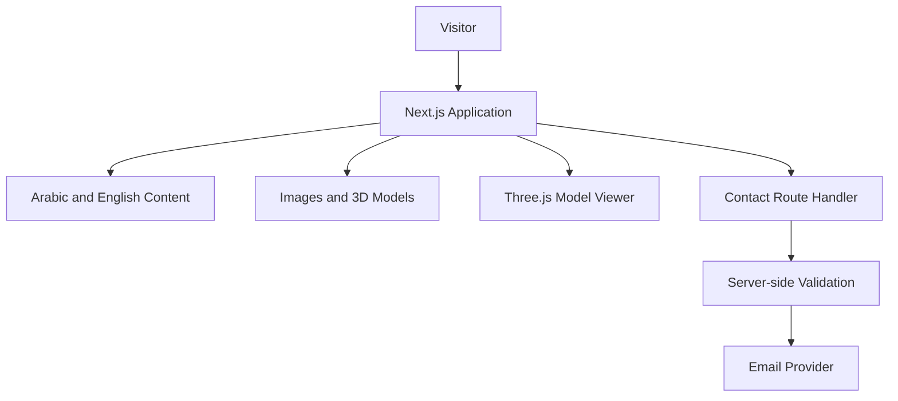

# Ahmed’s Bilingual Web Developer Portfolio

🚀 **Modern Web Development and Interactive 3D Experiences**

---

## 📌 Project Overview

A modern, bilingual web developer portfolio designed to present Ahmed’s web development skills, selected projects, interactive experiences, and 3D work in Arabic and English.

The website will use a one-page structure where visitors smoothly navigate between sections using a sticky navbar.

The main sections will include:

* Home
* How I Help Businesses Grow
* Services
* Featured Projects
* 3D Work
* About
* Skills
* Contact

The website will support:

* Arabic and English
* Right-to-left layout for Arabic
* Left-to-right layout for English
* Cairo font for Arabic content
* Responsive mobile and desktop layouts
* Dark and light themes
* Smooth section navigation
* Animated feature and service cards
* Interactive 3D models
* Accessible navigation and content
* Localized search-engine optimization
* Fast and optimized performance

The visual direction will combine modern minimalism with a premium futuristic technology style.

The interface will primarily use:

* A clean dark background
* Large typography
* Generous spacing
* Rounded cards
* Thin borders
* Subtle gradients
* Soft neon lighting
* Controlled pulsing effects
* Interactive 3D elements

Small neon-lighting details and subtle pulsing animations will create a distinctive technical atmosphere without overwhelming the content.

Neon and pulsing effects may appear on:

* Primary call-to-action buttons
* Active navbar indicators
* Important service icons
* Feature-card borders
* Section highlights
* 3D model display areas
* Decorative background elements
* Interactive hover states

The neon effects must remain restrained, professional, and consistent. They should support the visual hierarchy rather than distract visitors or reduce text readability.

Animations may include:

* Hero content entrance
* Scroll-triggered section reveals
* Staggered feature-card animations
* Subtle card hover movement
* Soft neon pulsing
* Animated icons
* Smooth navbar indicators
* 3D model transitions

All animations must be lightweight, mobile-friendly, and respect the visitor’s reduced-motion accessibility preference.

The portfolio will focus on business value rather than only presenting technical skills.

It should clearly explain how Ahmed’s work can help businesses:

* Establish a stronger online presence
* Improve professional credibility
* Reach Arabic- and English-speaking customers
* Create better customer experiences
* Generate more enquiries
* Present services more effectively
* Improve website speed and usability
* Introduce interactive and memorable 3D experiences

The primary objective is to help potential clients, employers, and collaborators quickly understand Ahmed’s capabilities, review his work, and contact him about web development or interactive 3D projects.

A résumé download will not be included.

---

## 🎯 Project Goals

The portfolio should:

* Establish a professional online presence
* Present Ahmed’s web development capabilities
* Showcase selected development projects
* Showcase interactive 3D models and experiences
* Explain the business value of each service
* Explain the problems solved by each project
* Support Arabic and English visitors
* Generate client enquiries
* Provide clear contact methods
* Perform well on mobile and desktop
* Maintain a professional visual identity

---

## 🧑‍💻 Target Visitors

| Visitor          | Main Need                                       |
| ---------------- | ----------------------------------------------- |
| Potential Client | Understand how Ahmed can support their business |
| Business Owner   | Review services and previous work               |
| Recruiter        | Quickly understand skills and experience        |
| Hiring Manager   | Review projects and technical decisions         |
| Developer        | Review technical work and source code           |
| Collaborator     | Explore development and 3D capabilities         |

---

## 🎨 Design Style

The design style can be described as:

> **Premium Futuristic Minimalism with Restrained Neon Lighting, Subtle Pulsing Accents, and Interactive 3D Elements**

### Main Characteristics

* Modern
* Minimal
* Premium
* Technology-focused
* Business-oriented
* Dark-first
* Futuristic without appearing excessive
* Professional rather than gaming-focused
* Spacious and easy to scan
* Visually engaging without reducing usability

### Visual Direction

Recommended visual elements:

* Charcoal or near-black backgrounds
* White or light-gray text
* One main neon accent color
* One optional secondary accent color
* Soft radial background glows
* Rounded cards
* Thin semi-transparent borders
* Subtle glass effects
* Large section headings
* Soft shadows
* Controlled gradients
* Interactive 3D presentation areas

### Possible Accent Colors

Choose one main accent direction:

* Neon cyan
* Electric blue
* Violet
* Blue-violet
* Emerald green

Avoid using too many neon colors at the same time.

---

## 🌍 Internationalization

The website will support two locales:

* English: `en`
* Arabic: `ar`

### Locale Routes

```text
/en
/ar
```

Because the website uses a one-page structure, sections will be accessed through anchors:

```text
/en#home
/en#business-growth
/en#services
/en#projects
/en#three-d
/en#about
/en#skills
/en#contact
```

Arabic equivalents:

```text
/ar#home
/ar#business-growth
/ar#services
/ar#projects
/ar#three-d
/ar#about
/ar#skills
/ar#contact
```

### Document Direction

The HTML document must dynamically use the correct language and direction.

```tsx
<html
  lang={locale}
  dir={locale === "ar" ? "rtl" : "ltr"}
>
```

### Localization Requirements

* Use `next-intl`
* Store Arabic and English messages separately
* Do not hard-code visible text in components
* Translate navigation labels
* Translate headings and descriptions
* Translate form labels and validation messages
* Translate metadata
* Preserve the selected language during navigation
* Preserve the current section when switching languages
* Use natural Arabic rather than literal translations
* Keep technical product names in English when appropriate

### Translation Files

```text
messages/
├── ar.json
└── en.json
```

Example English translations:

```json
{
  "Navigation": {
    "home": "Home",
    "businessGrowth": "Business Growth",
    "services": "Services",
    "projects": "Projects",
    "threeD": "3D Work",
    "about": "About",
    "skills": "Skills",
    "contact": "Contact"
  }
}
```

Example Arabic translations:

```json
{
  "Navigation": {
    "home": "الرئيسية",
    "businessGrowth": "تطوير الأعمال",
    "services": "الخدمات",
    "projects": "المشاريع",
    "threeD": "أعمال ثلاثية الأبعاد",
    "about": "نبذة عني",
    "skills": "المهارات",
    "contact": "تواصل معي"
  }
}
```

---

## 🔤 Typography

### Arabic Font

Use **Cairo** for all Arabic content.

```tsx
import {Cairo} from "next/font/google";

export const cairo = Cairo({
  subsets: ["arabic", "latin"],
  variable: "--font-cairo"
});
```

### English Font

Use one of the following:

* Geist
* Inter

Example:

```tsx
import {Geist} from "next/font/google";

export const geist = Geist({
  subsets: ["latin"],
  variable: "--font-geist"
});
```

### Locale-Based Font Selection

```tsx
<body
  className={
    locale === "ar"
      ? cairo.variable
      : geist.variable
  }
>
  {children}
</body>
```

Recommended CSS:

```css
html[lang="ar"] body {
  font-family: var(--font-cairo), sans-serif;
}

html[lang="en"] body {
  font-family: var(--font-geist), sans-serif;
}
```

---

## 🗺️ One-Page Website Structure

```text
/
├── #home
├── #business-growth
├── #services
├── #projects
├── #three-d
├── #about
├── #skills
└── #contact
```

---

## 1. Navbar

The navbar will appear at the top of the website.

### Navigation Items

* Home
* Business Growth
* Services
* Projects
* 3D Work
* About
* Skills
* Contact

### Navbar Controls

* Arabic and English language switcher
* Dark and light theme switcher
* Mobile menu button

### Navbar Requirements

* Sticky positioning
* Transparent or semi-transparent background
* Background blur when scrolling
* Active-section indicator
* Smooth scrolling
* RTL and LTR support
* Responsive mobile menu
* Keyboard accessibility
* Visible focus states
* Current language indication

### Neon Styling

The active navigation item may use:

* A small neon underline
* A glowing dot
* A soft animated border
* A subtle pulsing indicator

The effect should remain small and should not make the navbar difficult to read.

---

## 2. Hero Section

The hero section should immediately explain:

* Who Ahmed is
* What Ahmed builds
* Who Ahmed helps
* What visitors should do next

### Content

* Ahmed’s name
* Professional title
* Short introduction
* Business-focused value proposition
* Primary call-to-action
* Secondary call-to-action
* Optional profile image or 3D visual

### Suggested English Message

> I build modern bilingual websites and interactive digital experiences that help businesses strengthen their online presence and connect with more customers.

### Suggested Arabic Message

> أبني مواقع حديثة ثنائية اللغة وتجارب رقمية تفاعلية تساعد الشركات على تعزيز حضورها الرقمي والوصول إلى المزيد من العملاء.

### Suggested Calls-to-Action

* View My Work
* Start a Project
* شاهد أعمالي
* ابدأ مشروعك

### Hero Animation

Possible animations:

* Headline fade and slide
* Staggered text entrance
* Soft neon glow behind the main heading
* Subtle pulsing call-to-action border
* Small animated background particles
* Slowly moving gradient
* Optional interactive 3D object

Avoid large or aggressive motion.

---

## 3. How I Help Businesses Grow

This section should appear directly after the hero section.

Its purpose is to explain the value Ahmed provides to businesses.

### Stronger Online Presence

Build professional websites that improve credibility and make businesses easier to discover.

### More Customer Enquiries

Create clear landing pages, service pages, and calls-to-action that encourage visitors to contact the business.

### Better User Experience

Build fast, responsive, and accessible experiences that work properly across mobile and desktop devices.

### Higher Conversion Potential

Organize website content and user journeys around business goals and customer actions.

### Bilingual Market Reach

Create Arabic and English experiences that allow businesses to communicate with wider audiences.

### Interactive Brand Experiences

Use animations and 3D elements to make products, services, and brands more memorable.

### Long-Term Maintainability

Build structured websites that can be updated and expanded as the business grows.

### Section Presentation

Each benefit may appear in an animated card containing:

* Icon
* Short title
* Short explanation
* Optional statistic or result
* Subtle neon border

---

## 4. Services Section

The services section will explain what Ahmed can provide.

### Suggested Services

#### Business Websites

Professional websites designed around business goals, services, and customer needs.

#### Landing Pages

Focused pages designed for campaigns, products, services, or lead generation.

#### Bilingual Websites

Arabic and English websites with complete RTL and LTR support.

#### Frontend Development

Responsive interfaces built using modern React and Next.js practices.

#### Web Applications

Interactive applications, dashboards, portals, and business tools.

#### Website Redesign

Modernization of outdated websites, layouts, and user experiences.

#### Performance Optimization

Improvement of loading speed, responsiveness, Core Web Vitals, and usability.

#### Interactive 3D Experiences

Integration of 3D models, product visualizations, animations, and interactive scenes.

### Animated Service Cards

Animations may include:

* Fade-in on scroll
* Staggered entrance
* Slight upward movement
* Icon animation
* Border glow on hover
* Small card scale on hover
* Pulsing accent when highlighted

The card content must remain readable without animation.

---

## 5. Featured Projects

This section will showcase selected development projects.

### Each Project Should Include

* Project title
* Screenshot or preview
* Short description
* Business problem
* Implemented solution
* Key features
* Technologies used
* Live demo link
* GitHub link when public
* Project status

### Business-Focused Presentation

Projects should explain practical value such as:

* Improving user experience
* Increasing professional credibility
* Supporting Arabic and English users
* Simplifying a business workflow
* Improving performance
* Presenting services clearly
* Improving mobile usability
* Introducing interactive visual elements

### Project Card Animation

Possible effects:

* Image reveal
* Fade-in on scroll
* Slight hover tilt
* Neon border on hover
* Animated technology tags
* Smooth expansion for details

Do not use excessive 3D rotation that harms usability.

---

## 6. 3D Work Showcase

This section will present Ahmed’s 3D models and interactive experiences.

### Possible Content

* Interactive 3D models
* Product visualizations
* Environment designs
* Animated objects
* Web-based 3D experiments
* Rendered images
* Rendered videos
* Blender projects

### Possible Technologies

* Blender
* Three.js
* React Three Fiber
* Drei
* GLTF
* GLB
* WebGL

### Each 3D Project Should Include

* Project title
* Short description
* Tools used
* Interactive model or preview
* Loading state
* Static fallback image
* Optional fullscreen mode

### 3D Presentation Style

The model viewer may use:

* Dark display area
* Subtle neon edge lighting
* Soft glowing background
* Small pulsing loading indicator
* Model rotation controls
* Zoom controls
* Fullscreen button

### Performance Requirements

* Lazy-load models
* Compress GLTF and GLB assets
* Compress textures
* Use optimized texture dimensions
* Provide loading progress
* Pause rendering when not visible
* Avoid loading every model simultaneously
* Provide mobile fallbacks
* Provide static images when WebGL is unavailable
* Avoid unnecessary real-time shadows
* Limit expensive post-processing effects

---

## 7. About Section

The about section should provide a concise professional introduction.

### Content

* Short professional biography
* Web development background
* Interest in modern frontend development
* Interest in interactive 3D experiences
* Working approach
* Current technical focus
* Types of projects Ahmed wants to work on

### Suggested Positioning

The section should communicate that Ahmed combines:

* Technical development
* Business understanding
* Bilingual user experience
* Visual creativity
* Interactive technologies

A résumé download will not be included.

A profile image is optional.

---

## 8. Skills and Technologies

Skills should be grouped by category.

### Frontend

* HTML
* CSS
* JavaScript
* TypeScript
* React
* Next.js
* Tailwind CSS

### Backend

* Node.js
* NestJS
* REST APIs
* Databases

### Internationalization

* Arabic RTL development
* English LTR development
* next-intl
* Localized SEO
* Accessible bilingual interfaces

### 3D

* Blender
* Three.js
* React Three Fiber
* Drei
* GLTF and GLB workflows

### Tools

* Git
* GitHub
* Figma
* Vercel

Only include technologies Ahmed can confidently discuss with potential clients or employers.

### Skills Animation

Possible effects:

* Staggered tag appearance
* Progressively revealed categories
* Soft icon glow
* Small hover pulse
* Animated connecting lines

Avoid skill percentage bars unless the values can be justified.

---

## 9. Contact Section

The contact section should encourage clients, employers, and collaborators to get in touch.

### Suggested English Message

> Have a website, web application, or interactive 3D idea? Let’s discuss how it can support your business.

### Suggested Arabic Message

> لديك فكرة لموقع أو تطبيق ويب أو تجربة ثلاثية الأبعاد؟ دعنا نناقش كيف يمكن تحويلها إلى تجربة رقمية تدعم أعمالك.

### Contact Methods

* Contact form
* Email
* GitHub
* LinkedIn
* Optional WhatsApp
* Optional availability status

### Contact Form Fields

* Name
* Email
* Subject
* Message

### Form Requirements

* Client-side validation
* Server-side validation
* Loading state
* Success state
* Error state
* Spam protection
* Rate limiting
* Localized validation messages
* Accessible labels
* Accessible error messages

### Contact Call-to-Action Styling

The main submit button may use:

* Soft neon border
* Small pulsing glow
* Hover illumination
* Loading pulse during submission

---

## 10. Footer

The footer should include:

* Ahmed’s name
* Copyright notice
* GitHub link
* LinkedIn link
* Email link
* Language switcher
* Back-to-top button

The footer should remain simple and should not compete visually with the main content.

---

## 🎬 Animation System

Animation should improve storytelling without distracting visitors.

### Recommended Animated Elements

* Hero heading
* Hero buttons
* Section headings
* Business-growth cards
* Service cards
* Project cards
* Skill groups
* Active navbar indicator
* 3D model loading state
* Contact call-to-action
* Decorative background elements

### Neon Pulsing Effects

Pulsing may be applied to:

* Primary buttons
* Active navigation markers
* Small status indicators
* Featured service cards
* Important icons
* 3D loading indicators

### Example CSS Pulse

```css
@keyframes neon-pulse {
  0%,
  100% {
    box-shadow:
      0 0 0 rgba(34, 211, 238, 0),
      0 0 12px rgba(34, 211, 238, 0.2);
  }

  50% {
    box-shadow:
      0 0 8px rgba(34, 211, 238, 0.25),
      0 0 24px rgba(34, 211, 238, 0.35);
  }
}

.neon-pulse {
  animation: neon-pulse 3s ease-in-out infinite;
}
```

### Reduced Motion

```css
@media (prefers-reduced-motion: reduce) {
  *,
  *::before,
  *::after {
    scroll-behavior: auto !important;
    animation-duration: 0.01ms !important;
    animation-iteration-count: 1 !important;
    transition-duration: 0.01ms !important;
  }
}
```

### Avoid

* Constant large background movement
* Fast flashing effects
* Excessive parallax
* Heavy blur effects
* Animating every paragraph
* Long page-entry animations
* Large model files loading immediately
* Strong neon glow behind body text

---

## 🧱 Technology Stack

| Category       | Choice                         |
| -------------- | ------------------------------ |
| Framework      | Next.js 16                     |
| UI Library     | React 19                       |
| Language       | TypeScript                     |
| Styling        | Tailwind CSS v4                |
| Localization   | next-intl                      |
| Icons          | Lucide React                   |
| Animation      | Motion for React and CSS       |
| 3D             | Three.js and React Three Fiber |
| 3D Helpers     | Drei                           |
| Validation     | Zod                            |
| Contact Form   | Server Action or Route Handler |
| Email Provider | Resend or Formspree            |
| Deployment     | Vercel                         |
| Analytics      | Vercel Analytics, optional     |
| Monitoring     | Sentry, optional               |

---

## 🗂️ Suggested Project Structure

```text
portfolio/
├── messages/
│   ├── ar.json
│   └── en.json
│
├── public/
│   ├── images/
│   │   ├── projects/
│   │   ├── three-d/
│   │   └── profile/
│   ├── models/
│   │   ├── model-one.glb
│   │   └── model-two.glb
│   └── icons/
│
├── src/
│   ├── app/
│   │   ├── [locale]/
│   │   │   ├── layout.tsx
│   │   │   └── page.tsx
│   │   ├── api/
│   │   │   └── contact/
│   │   │       └── route.ts
│   │   ├── globals.css
│   │   ├── robots.ts
│   │   └── sitemap.ts
│   │
│   ├── components/
│   │   ├── layout/
│   │   │   ├── navbar.tsx
│   │   │   ├── mobile-menu.tsx
│   │   │   ├── footer.tsx
│   │   │   ├── language-switcher.tsx
│   │   │   └── theme-toggle.tsx
│   │   │
│   │   ├── sections/
│   │   │   ├── hero-section.tsx
│   │   │   ├── business-growth-section.tsx
│   │   │   ├── services-section.tsx
│   │   │   ├── projects-section.tsx
│   │   │   ├── three-d-section.tsx
│   │   │   ├── about-section.tsx
│   │   │   ├── skills-section.tsx
│   │   │   └── contact-section.tsx
│   │   │
│   │   ├── three-d/
│   │   │   ├── model-viewer.tsx
│   │   │   ├── model-loader.tsx
│   │   │   └── model-fallback.tsx
│   │   │
│   │   └── ui/
│   │       ├── button.tsx
│   │       ├── neon-button.tsx
│   │       ├── service-card.tsx
│   │       ├── project-card.tsx
│   │       ├── section-heading.tsx
│   │       ├── technology-badge.tsx
│   │       └── animated-container.tsx
│   │
│   ├── data/
│   │   ├── projects.ts
│   │   ├── services.ts
│   │   ├── skills.ts
│   │   ├── three-d-projects.ts
│   │   └── social-links.ts
│   │
│   ├── i18n/
│   │   ├── navigation.ts
│   │   ├── request.ts
│   │   └── routing.ts
│   │
│   ├── lib/
│   │   ├── metadata.ts
│   │   ├── validation.ts
│   │   └── utils.ts
│   │
│   └── types/
│       ├── project.ts
│       ├── service.ts
│       ├── three-d-project.ts
│       └── locale.ts
│
├── middleware.ts
├── next.config.ts
├── package.json
└── tsconfig.json
```

---

## 🗃️ Content Model

The initial portfolio does not require a database.

Content should be stored in typed TypeScript files.

### Localized Text Type

```ts
export type LocalizedText = {
  en: string;
  ar: string;
};
```

### Project Type

```ts
export type Project = {
  slug: string;
  title: LocalizedText;
  summary: LocalizedText;
  problem: LocalizedText;
  solution: LocalizedText;
  image: string;
  technologies: string[];
  features: LocalizedText[];
  liveUrl?: string;
  repositoryUrl?: string;
  featured: boolean;
  status: "completed" | "in-progress" | "planned";
};
```

### Service Type

```ts
export type Service = {
  id: string;
  title: LocalizedText;
  description: LocalizedText;
  icon: string;
  featured?: boolean;
};
```

### 3D Project Type

```ts
export type ThreeDProject = {
  slug: string;
  title: LocalizedText;
  description: LocalizedText;
  modelUrl?: string;
  previewImage: string;
  tools: string[];
  interactive: boolean;
};
```

---

## 🔌 Application Architecture



The website should remain mostly statically rendered.

Server-side execution should only be used where required, such as contact-form submission.

---

## 🔐 Security Requirements

Security is mandatory.

### Secrets

* Never expose API keys in client-side code
* Never expose service-role credentials
* Never commit `.env` files
* Store private values in server-side environment variables
* Only use `NEXT_PUBLIC_` for intentionally public values

### Contact Form

* Validate all input on the server
* Restrict field lengths
* Reject malformed submissions
* Add rate limiting
* Add spam protection
* Do not trust client-side validation
* Do not return internal error details
* Safely handle submitted text

### Dependencies

* Do not run `npm audit fix --force` without reviewing changes
* Keep Next.js and dependencies updated
* Prefer stable supported releases
* Review dependency overrides before using them
* Run builds after dependency updates
* Review production audit results
* Do not downgrade Next.js to resolve an incorrect automated suggestion

### 3D Assets

* Only use trusted models
* Do not allow public model uploads in the MVP
* Validate downloaded third-party models before adding them
* Keep model files inside approved project assets
* Avoid embedding untrusted scripts or viewers

### Public Uploads

The MVP will not allow visitors to upload:

* Images
* Files
* CSS
* 3D models
* Documents

---

## ♿ Accessibility

The website should follow WCAG 2.1 AA practices.

Requirements:

* Semantic HTML
* Keyboard-accessible navigation
* Visible focus indicators
* Descriptive alternative text
* Form labels
* Accessible form errors
* Sufficient color contrast
* Correct heading hierarchy
* Reduced-motion support
* Correct `lang` and `dir` values
* Accessible mobile menu
* Screen-reader-friendly language switcher
* Static alternatives for 3D content
* No flashing neon effects

Neon effects must not be the only method used to communicate state or importance.

---

## 🔍 SEO Requirements

Each locale must have localized metadata.

### Required Features

* Arabic and English page titles
* Localized descriptions
* Canonical URLs
* `hreflang` alternatives
* Open Graph metadata
* Social sharing images
* Sitemap
* Robots configuration
* Structured data
* Localized business and portfolio content

### Example Metadata

```ts
export async function generateMetadata({
  params
}: {
  params: Promise<{locale: string}>;
}) {
  const {locale} = await params;

  return {
    title:
      locale === "ar"
        ? "أحمد | مطور ويب وتجارب ثلاثية الأبعاد"
        : "Ahmed | Web Developer and 3D Experiences",

    description:
      locale === "ar"
        ? "مطور ويب متخصص في بناء مواقع ثنائية اللغة وتجارب رقمية وتفاعلية ثلاثية الأبعاد."
        : "A web developer building bilingual websites, digital products, and interactive 3D experiences."
  };
}
```

---

## ⚡ Performance Requirements

The portfolio should aim for strong Lighthouse scores.

| Category       | Target       |
| -------------- | ------------ |
| Performance    | 90 or higher |
| Accessibility  | 90 or higher |
| Best Practices | 90 or higher |
| SEO            | 90 or higher |

### Implementation Requirements

* Use `next/image`
* Use WebP or AVIF images
* Lazy-load 3D models
* Avoid unnecessary client components
* Prefer server components
* Load fonts efficiently
* Reduce JavaScript bundle size
* Lazy-load non-critical sections
* Prevent layout shifts
* Use compressed model files
* Disable expensive 3D effects on weak devices
* Respect reduced-motion preferences

---

## 🧪 Testing

### Functional Testing

Test:

* Arabic route
* English route
* Language switching
* Section preservation when switching languages
* RTL layout
* LTR layout
* Sticky navigation
* Active-section indicator
* Smooth scrolling
* Mobile menu
* Theme switching
* Service animations
* Project links
* 3D model loading
* 3D fallback image
* Contact-form validation
* Contact-form submission

### Browser Testing

Test current versions of:

* Chrome
* Safari
* Firefox
* Edge
* Mobile Safari
* Chrome for Android

### Automated Testing

Possible tools:

* Vitest
* React Testing Library
* Playwright

Automated tests may be added after the main MVP interface is complete.

---

## 🗂️ Development Workflow

Use feature-based Git branches.

```bash
git switch -c feature/project-setup
git switch -c feature/internationalization
git switch -c feature/one-page-navigation
git switch -c feature/hero
git switch -c feature/business-growth
git switch -c feature/services
git switch -c feature/projects
git switch -c feature/three-d-showcase
git switch -c feature/contact-form
git switch -c feature/seo
```

Recommended commit style:

```text
feat: configure bilingual one-page routing
feat: add Arabic Cairo font
feat: implement RTL and LTR layouts
feat: build animated business growth cards
feat: add interactive 3D model viewer
style: add subtle neon button glow
fix: respect reduced motion preferences
perf: lazy-load 3D models
```

Before merging:

```bash
npm run lint
npm run build
```

---

## 🧭 Development Roadmap

### Phase 1 — Planning and Content

* Finalize the website sections
* Prepare Arabic content
* Prepare English content
* Select featured projects
* Prepare project screenshots
* Prepare project links
* Select 3D models
* Prepare model preview images
* Define colors
* Select the main neon accent
* Finalize typography

### Phase 2 — Foundation

* Configure Next.js
* Configure TypeScript
* Configure Tailwind CSS
* Configure `next-intl`
* Create `/ar` and `/en`
* Configure RTL and LTR
* Add Cairo and English fonts
* Create the one-page section structure
* Add global colors and spacing

### Phase 3 — Navigation

* Build sticky navbar
* Add desktop navigation
* Add mobile menu
* Add smooth section scrolling
* Add active-section tracking
* Add language switcher
* Preserve the active section when changing languages
* Add theme switcher

### Phase 4 — Main Sections

* Build hero section
* Build business-growth section
* Build services section
* Build projects section
* Build about section
* Build skills section
* Build contact section
* Build footer

### Phase 5 — Animation and Neon Styling

* Add hero entrance animation
* Add scroll reveals
* Add staggered service cards
* Add project-card hover states
* Add active navigation glow
* Add subtle button pulsing
* Add reduced-motion support
* Test mobile animation performance

### Phase 6 — 3D Showcase

* Install Three.js dependencies
* Add React Three Fiber
* Add Drei
* Optimize GLB models
* Create model viewer
* Add loading progress
* Add static fallback images
* Add lazy loading
* Pause rendering outside the viewport
* Test mobile performance

### Phase 7 — Contact and Integrations

* Add contact form
* Add Zod validation
* Add server-side validation
* Connect the email provider
* Add rate limiting
* Add spam protection
* Add localized success and error messages
* Add social links

### Phase 8 — Quality and Deployment

* Add localized metadata
* Add sitemap
* Add robots configuration
* Test Arabic typography
* Test RTL and LTR
* Test keyboard navigation
* Test color contrast
* Optimize images and models
* Run Lighthouse
* Run dependency audit
* Deploy to Vercel
* Configure environment variables
* Connect a custom domain

---

## ✅ MVP Scope

The first release will include:

* One-page layout
* Arabic and English
* Arabic Cairo font
* RTL and LTR support
* Sticky navbar
* Active-section navigation
* Hero section
* Business-growth section
* Animated services section
* Featured projects
* 3D work showcase
* About section
* Skills section
* Contact form
* GitHub and LinkedIn links
* Dark and light themes
* Subtle neon lighting
* Subtle pulsing effects
* Responsive design
* Localized SEO metadata
* Accessible components
* Vercel deployment

The MVP will not include:

* Résumé download
* Blog
* Database
* CMS
* Visitor file uploads
* Visitor 3D model uploads
* User authentication

---

## 🔮 Future Enhancements

Possible later improvements:

* Blog section
* Arabic and English articles
* Project filters
* Project search
* Testimonials
* Work experience timeline
* Certifications
* GitHub activity integration
* Content management system
* Advanced view transitions
* Additional 3D scenes
* Interactive product configurators
* Analytics dashboard
* Additional languages

A database or CMS should only be added when local content becomes difficult to maintain.

---

## 📋 Required Content

### Personal Information

* Full English name
* Full Arabic name
* English professional title
* Arabic professional title
* English biography
* Arabic biography
* Contact email
* Optional location
* Optional availability status

### Professional Links

* GitHub
* LinkedIn
* Optional WhatsApp
* Other professional profiles

### Development Projects

For each project:

* English title
* Arabic title
* English summary
* Arabic summary
* Business problem
* Implemented solution
* Features
* Technologies
* Screenshot
* Live demo
* Repository link
* Completion status

### 3D Projects

For each 3D project:

* English title
* Arabic title
* English description
* Arabic description
* Model file
* Preview image
* Tools used
* Interactive or static status
* Model size
* Optional rendered video

---

## 📌 Current Status

* Project initialized
* Next.js installed
* React installed
* TypeScript installed
* Tailwind CSS installed
* `next-intl` installed
* Arabic and English confirmed
* One-page structure confirmed
* Cairo selected for Arabic text
* Interactive 3D work confirmed
* Résumé removed from scope
* Subtle neon lighting confirmed
* Subtle pulsing effects confirmed
* Security requirements established
* Ready for bilingual routing and one-page layout configuration

---

🏗️ **Ahmed’s Portfolio — Modern Web Development and Interactive 3D Experiences in Arabic and English**
